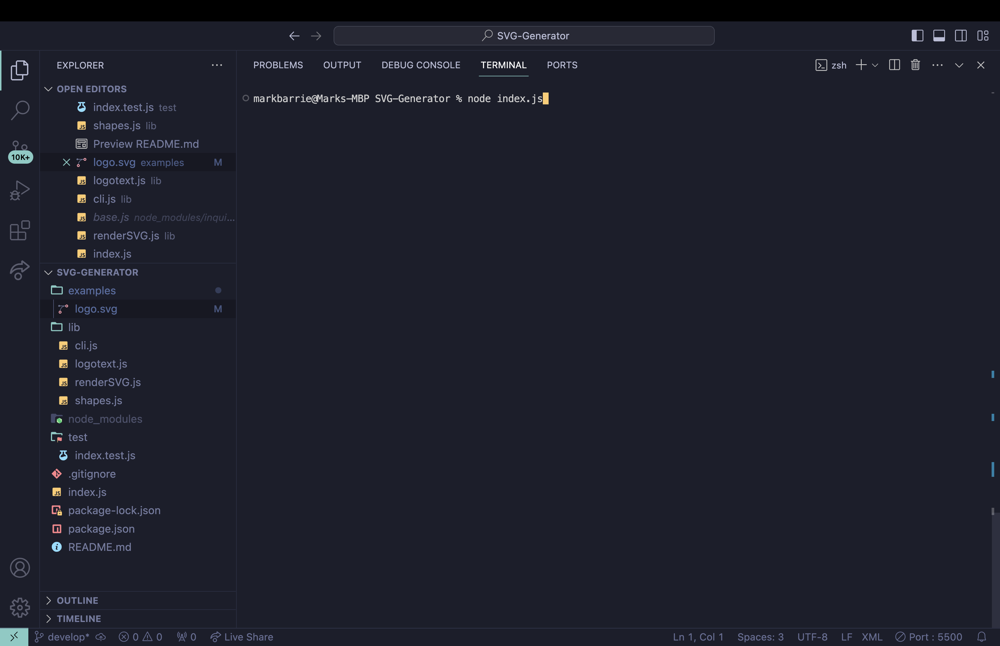
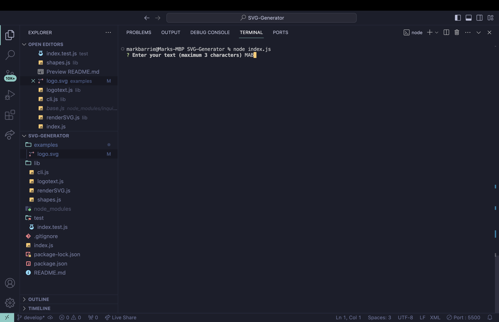
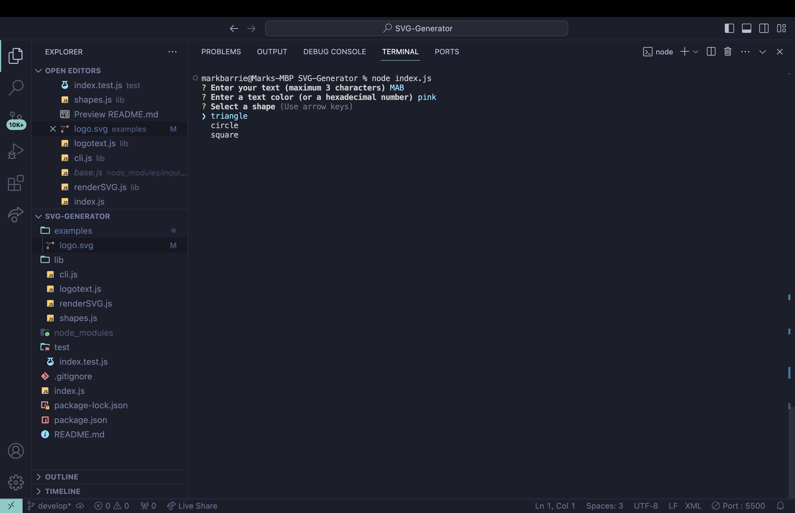
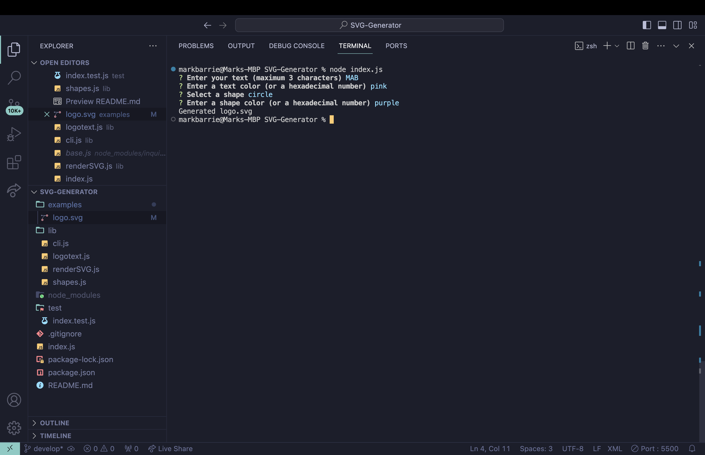
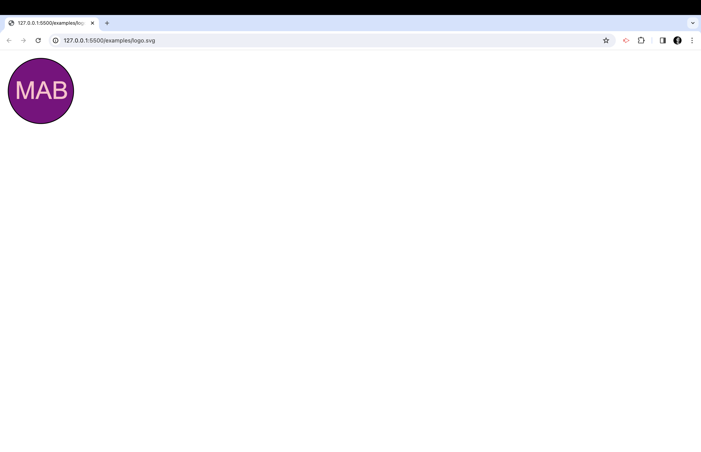

# SVG Logo Maker

SVG Logo Maker is a command-line interface (CLI) application that enables users to create simple SVG logos with customizable text, shapes, and colors. Whether you need a quick logo for your project or just want to experiment with SVG creation, SVG Logo Maker provides an easy-to-use platform to generate SVG files directly from your terminal.

## Features

- Generate SVG logos with a choice of shapes: Circle, Square, or Triangle.
- Customize the color of both text and shapes.
- Specify text for your logo with a limit of 3 characters, optimized for initials or icons.
- Automatically saves SVG files to a designated folder for easy access and use.

## Getting Started

### Prerequisites

- Node.js installed on your system.

### Installation

1. Clone the repository to your local machine.
   ```
   git clone https://github.com/mbarrie1979/SVG-Generator.git
   ```
2. Navigate to the SVG Logo Maker directory.
   ```
   cd SVG-Generator
   ```
3. Install the required npm packages.
   ```
   npm install
   ```

### Usage

Run the application by executing the following command in your terminal:

```
node index.js
```

Follow the prompt instructions to customize your SVG logo. After completion, the generated SVG file will be saved in the `examples` directory.

## Screenshots

Here are some examples of logos created with SVG Logo Maker:

1. 
2. 
3. 
4. 
5. 


## Development

This project is built using Node.js and leverages the `inquirer` package for CLI interactions, and the `fs` module for file operations.

### Key Components

- `index.js`: Entry point of the application that invokes the CLI.
- `cli.js`: Handles the CLI interactions and logo generation logic.
- `shapes.js`: Defines the Shape classes (Circle, Square, Triangle) used for SVG generation.
- `logotext.js`: Manages the creation and rendering of text for the SVG.
- `renderSVG.js`: Combines shape and text data into a complete SVG file format.

### Testing

Run tests using Jest with the following command:

```
npm test
```

Tests are located in `index.test.js` and cover basic functionality of the shape classes.

## Contributions

Contributions are welcome! Please submit a pull request or open an issue for any features or improvements.

## Credits
Mark Barrie - developer

## Video Walkthrough


